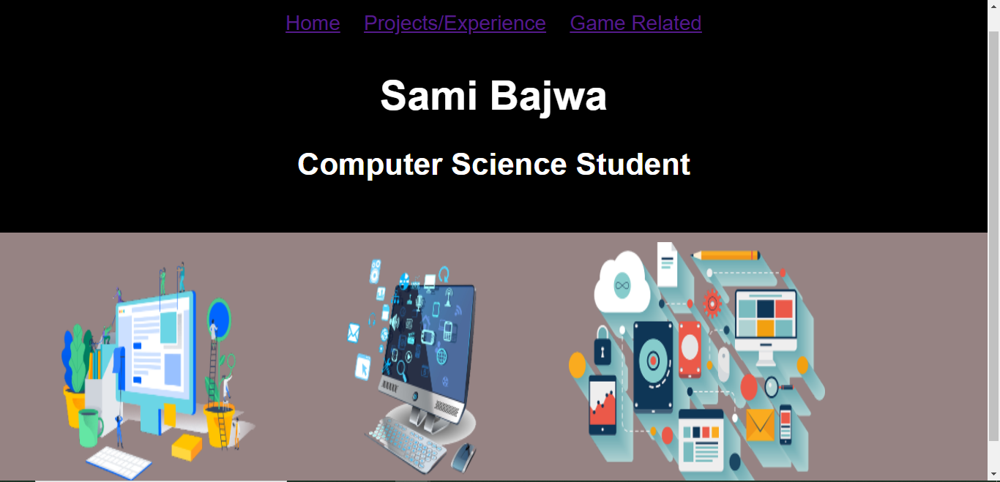
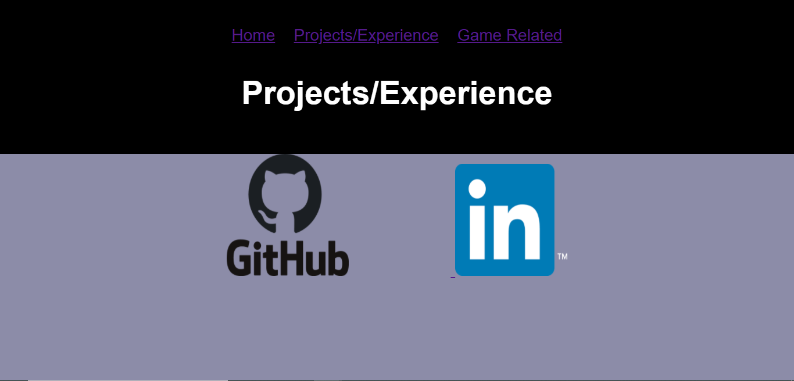
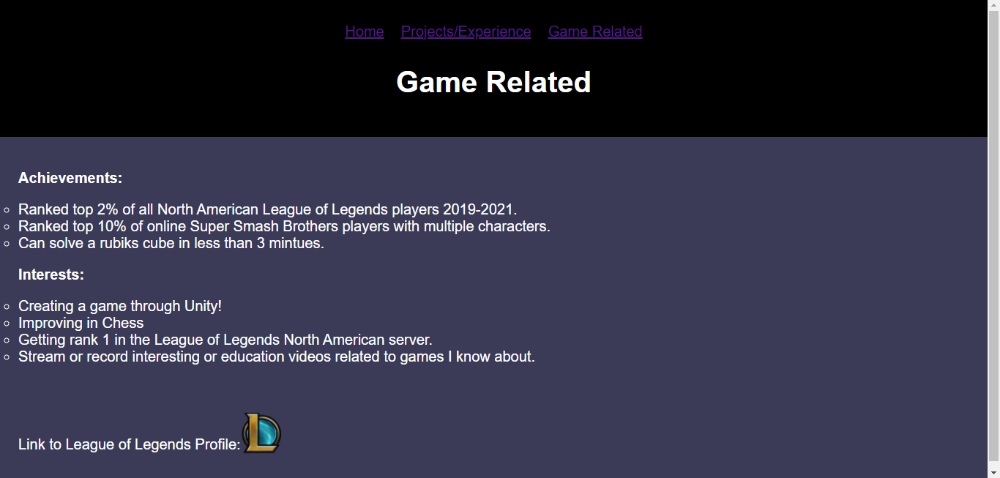

# WebsiteAboutMe

This is a screenshot of the home page. At the top are three buttons. The home button is for redirecting the user to this home page. The other two buttons redirect the user to two other pages which I will show below.

This is a screenshot of the projects/experience page which the user can go to by pressing on the "Projects/Experience" button at the top. The images of the Github and Linkedin logos are links that take the user to my Github and Linkedin.

This is a screenshot of the game related page which the user can go to by pressing on the "Game Related" button at the top. This screenshot is zoomed out so that we can see the whole page with one screenshot. At the bottom is an image of the League of Legends logo, which is a link to my League of Legends profile.

